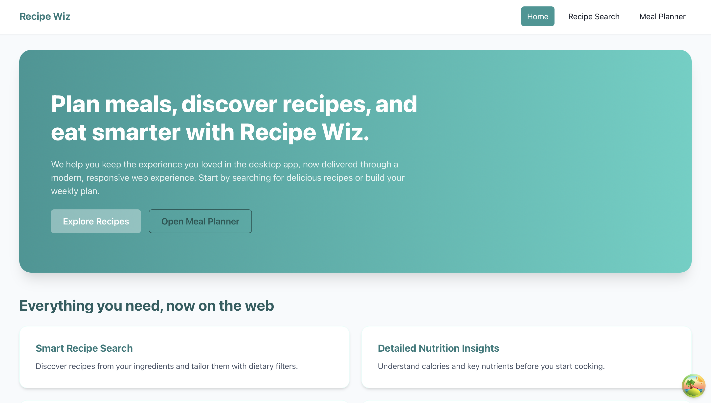
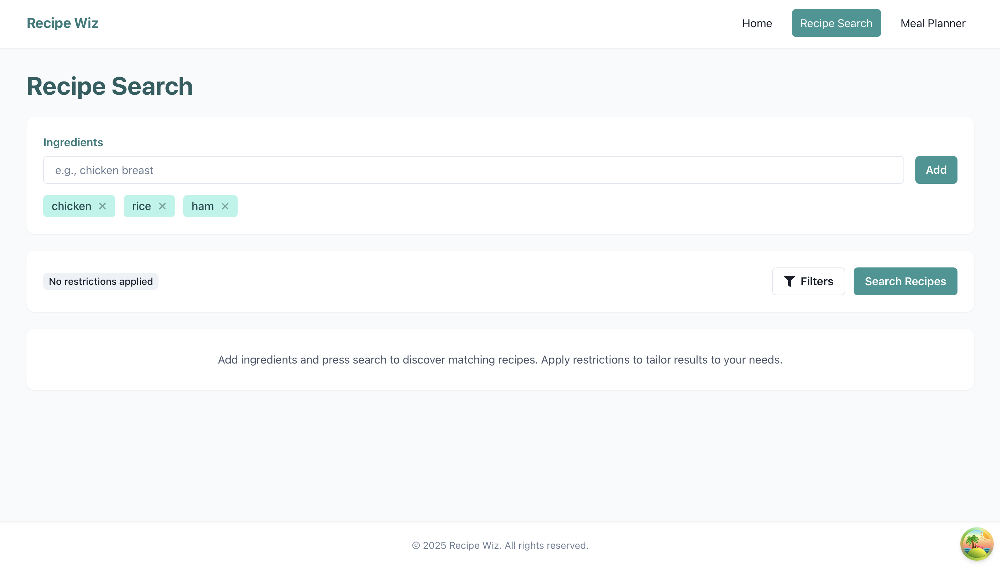
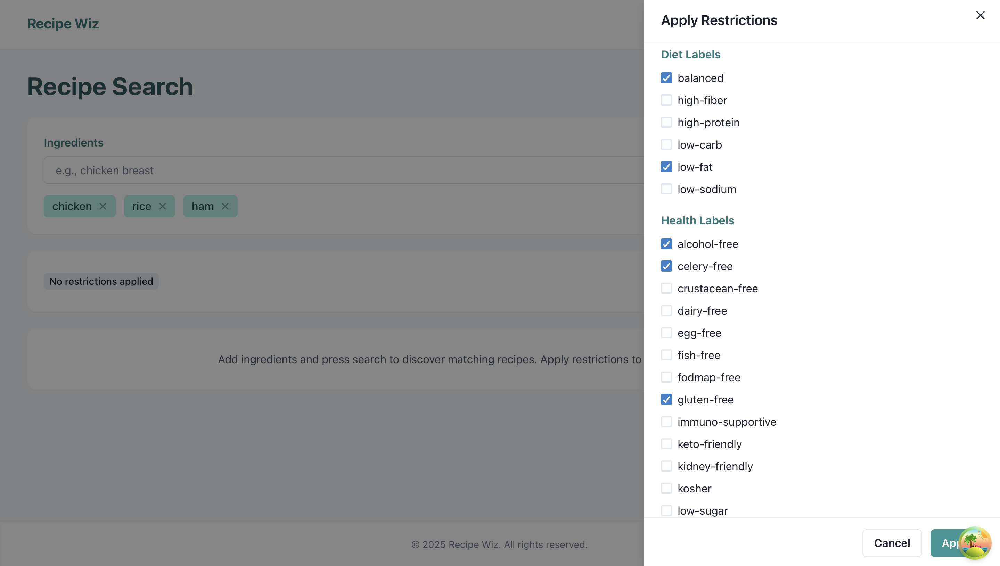
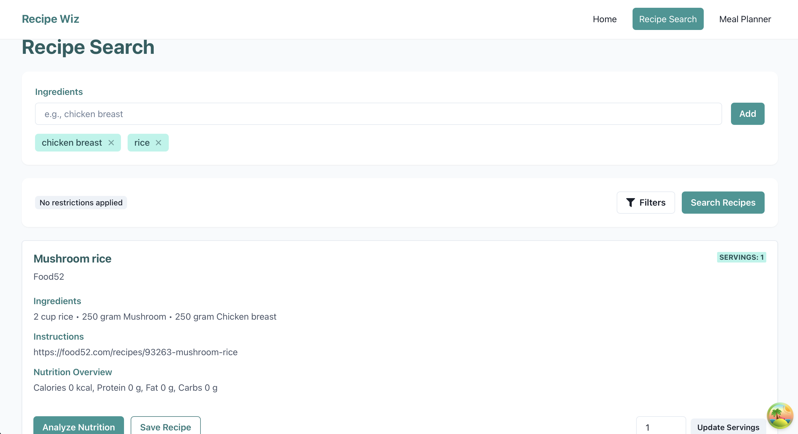
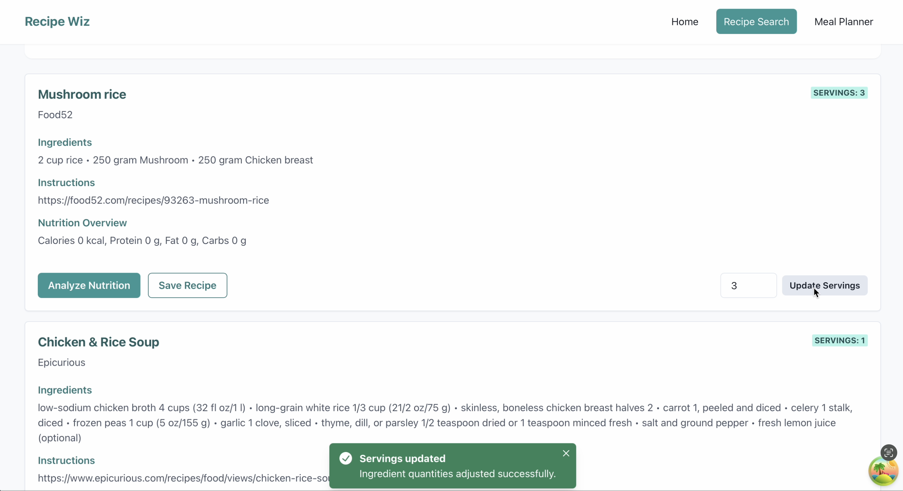
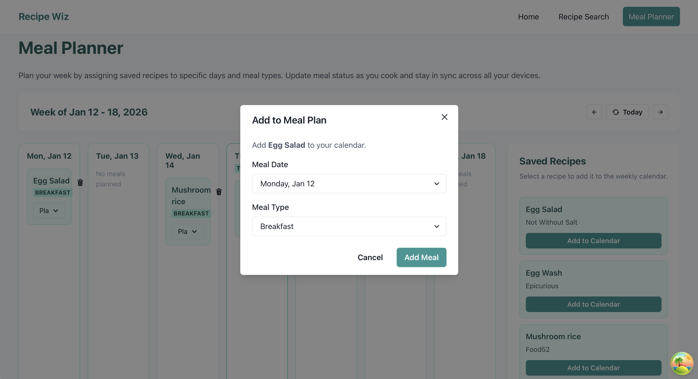

# Recipe Wiz

[English](./README.md) | **中文**

## 项目简介

Recipe Wiz 是一款创新的膳食规划与食谱管理应用，旨在简化您的烹饪体验。它可以帮助用户根据手边的食材、饮食偏好或特定餐次来发现合适的食谱。凭借营养分析、个性化膳食计划、自动购物清单以及可调整份量等功能，Recipe Wiz 让餐食准备既高效又健康。

## 目录

1. [作者](#作者)
2. [核心功能](#核心功能)
3. [安装说明](#安装说明)
4. [使用指南](#使用指南)
5. [许可证](#许可证)
6. [支持与反馈](#支持与反馈)
7. [如何贡献](#如何贡献)
8. [API 使用](#api-使用)

## 作者
- Xineng Na
  - (@Alan-Na)

## 核心功能

- **智能食谱搜索**
    - 根据手边食材快速查找食谱。
    - 按餐次类型和饮食限制筛选结果。
    - 接入 Edamam Recipe API，提供海量食谱选择。

- **详细营养信息**
    - 查看每道食谱的全面营养数据。
    - 包含卡路里、宏量营养素及其他关键营养元素。

- **个性化膳食计划**
    - 以周历形式安排每日餐食。
    - 轻松添加、修改或移除计划中的食谱。
    - 保存膳食计划以供日后参考。

- **灵活调整份量**
    - 根据所需份数修改食谱。
    - 食材用量自动重新计算。

- **饮食偏好与限制**
    - 支持无麸质、素食、纯素、低碳水等多种过滤条件。
    - 确保所有推荐食谱符合您的饮食需求。

## 安装说明

安装 Recipe Wiz 前，请确认系统满足以下要求：

1. **Java 开发工具包（JDK）22 或更高版本**
    - 从 [Oracle 官网](https://www.oracle.com/java/technologies/downloads/) 下载最新 JDK。

2. **语言级别**
    - 在 IDE 设置中将项目语言级别设置为 **16**。

3. **集成开发环境（IDE）**
    - 推荐使用：[IntelliJ IDEA](https://www.jetbrains.com/idea/download/)。

### 安装步骤

1. **克隆仓库 main 分支**

   ```bash
   git clone https://github.com/Alan-Na/Recipe-Wiz.git
   ```

2. **在 IntelliJ IDEA 中打开项目**

   - 启动 IntelliJ IDEA，点击 File > Open，导航到克隆的 recipe-wiz 目录并选中。

3. **配置 JDK 和语言级别**

   - 前往 File > Project Structure。在 Project Settings > Project 下，将 Project SDK 设置为已安装的 JDK 22 或更高版本。在 Project Settings > Modules 中选择您的模块，在 Sources 标签页中将语言级别设置为 16 - Records, patterns, local enums and interfaces。

4. **导入项目依赖**

   - 项目使用 Maven，右键点击 pom.xml，选择 Maven > Reload Project。

5. **运行应用**

   - 在项目资源管理器中找到 MainRecipeApplication.java，选择 Run 'MainRecipeApplication.main()'。应用启动后即可开始使用 Recipe Wiz。

### 常见安装问题

1. **依赖解析失败**

   - 尝试刷新项目依赖：右键点击项目，选择 Maven > Reload Project。

2. **JDK 版本不正确**

   - 在 IDE 中确认 Project SDK 已设置为 JDK 22 或更高版本，同时检查各模块是否也使用了正确的 SDK。

3. **语言级别问题**

   - 如果遇到语言特性相关的错误，请确认 Project Language Level 已设置为 16。前往 File > Project Structure > Project 进行设置，并在 Project Settings > Modules 下检查模块的语言级别。

## 使用指南

程序启动后，您将看到首页视图。点击"食谱搜索"进入食谱搜索页，点击"膳食计划"则进入膳食规划日历。



### 如何使用食谱搜索

1. 在食材输入框中输入食材名称，点击添加按钮即可将其加入食材列表。选中列表中的食材后点击移除按钮可将其删除。



2. 点击筛选按钮可添加限制条件，弹出的筛选窗口支持选择饮食标签、健康标签、菜系类型等。已添加的限制条件可通过同样方式选中后点击移除按钮删除。



3. 点击搜索按钮，将根据已填写的食材和限制条件搜索食谱。



4. 在份量输入框中填写数字后点击更新，结果列表中的食谱将按新份量重新计算食材用量。



5. 选中某道食谱后点击"营养分析"按钮，即可查看该食谱的详细营养信息。

6. 点击"保存食谱"按钮，可将食谱保存至膳食计划日历。

### 如何使用膳食计划

1. 从食谱搜索页保存的食谱将出现在膳食计划面板中，供您灵活安排。

2. 选择餐次类型，将食谱添加到日历中指定日期，规划当天的饮食。

3. 已添加到日历中的膳食数据会持久保存，程序重新启动后将自动恢复之前的膳食计划。



## 许可证

本项目采用 **MIT 许可证**，这意味着您可以自由地：
  - 将代码用于个人或商业用途。
  - 修改并分发代码。
  - 将代码纳入专有软件。

但您**必须**：
  - 在软件的所有副本中保留原始版权声明和许可声明。
  - 不得追究原作者对软件使用造成的任何损失的责任。

完整的 MIT 许可证文本请查阅仓库中的 [LICENSE](./LICENSE) 文件。

## 支持与反馈

我们重视您的意见，欢迎通过以下方式提供反馈以帮助改善 Recipe Wiz：

1. **GitHub Issues**

   - 在 GitHub [Issues](https://github.com/Alan-Na/Recipe-Wiz/issues) 页面提交反馈、报告 Bug 或建议新功能。

2. **讨论区**

   - 在 GitHub [Discussions](https://github.com/Alan-Na/Recipe-Wiz/discussions) 参与社区讨论。

### 反馈规范

**有效反馈应包含**：

1. 对问题或建议的清晰描述。
2. 如适用，提供复现 Bug 的步骤。
3. 相关截图、日志或示例以支持您的观点。

**处理流程**

1. 我们力争在 1 周内审阅并回复反馈。
2. 经核实后，我们将根据严重程度优先处理修复。
3. 提供有效反馈并推动改进的贡献者，可能在项目更新说明中获得致谢。

## 如何贡献

我们欢迎社区成员为 Recipe Wiz 做出贡献！

### 贡献步骤

1. **Fork 仓库**

   - 点击仓库页面右上角的 Fork 按钮。

2. **克隆您的 Fork**

   ```bash
   git clone https://github.com/Alan-Na/Recipe-Wiz.git
   ```

3. **创建新分支**

   - 在新分支上进行修改。

4. **实现您的更改**

   - 修复 Bug、开发新功能或在分支上贡献代码。

5. **提交更改**

   - 完成更改后，使用有意义的提交信息提交代码。

6. **推送更改**

7. **提交 Pull Request**

   - 前往原始仓库，点击 New Pull Request，并提供清晰详细的更改说明。

## API 使用

Recipe Wiz 接入了强大的 **Edamam API**，以提供全面的食谱搜索和营养分析能力。以下是各 API 的使用说明：

### 1. 食谱搜索 API

Edamam **食谱搜索 API** 用于：

- 根据食材、饮食限制和餐次类型搜索食谱。
- 获取每道食谱的丰富数据，包括：
    - 食谱名称、图片和制作步骤。
    - 带用量的食材列表。
    - 饮食标签（如无麸质、素食）。
    - 健康标签（如低碳水、生酮友好）。

该 API 确保 Recipe Wiz 能够为不同偏好和饮食需求的用户提供个性化、多样化的食谱推荐。

### 2. 营养分析 API

Edamam **营养分析 API** 驱动 Recipe Wiz 的营养信息功能，用于：

- 分析食谱并计算详细营养数据，包括：
    - 卡路里。
    - 宏量营养素（蛋白质、脂肪、碳水化合物）。
    - 微量营养素（膳食纤维、糖分、维生素）。
- 以直观易懂的方式展示每道食谱的营养细分，帮助用户做出明智的饮食选择。

### API 文档

更多 API 详情请参阅 Edamam 官方文档：

- [食谱搜索 API 文档](https://developer.edamam.com/edamam-recipe-api)
- [营养分析 API 文档](https://developer.edamam.com/edamam-nutrition-api)
